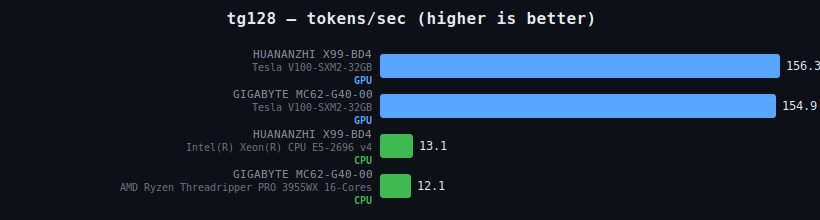
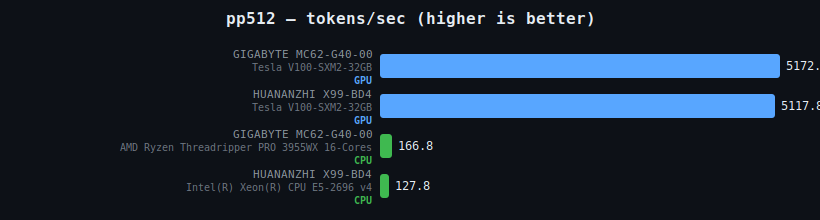

# llamaboard

Community-driven **llama.cpp inference benchmarks across hardware**. Run one script, get
CPU and GPU token-throughput numbers for your machine, and (optionally) submit them via a
pull request so they show up on the shared leaderboard.

## Latest results





> Interactive, filterable charts: **https://okigan.github.io/llamaboard/**

## How it works

1. You run [`scripts/bench.sh`](scripts/bench.sh).
2. It builds `llama-bench` from [llama.cpp](https://github.com/ggml-org/llama.cpp) — a
   native CPU-only build, plus a CUDA build when an NVIDIA GPU is present.
3. It benchmarks each configured model on CPU and GPU, capturing hardware metadata
   (motherboard, CPU model, GPU model, temperatures).
4. Results are written to `results/<YYYY>/<MM>/<DD>/<host-hash>.json`.
5. Optionally, it opens a pull request with your results.
6. When the PR is merged, a GitHub Action regenerates the charts above and redeploys the
   interactive page to GitHub Pages.

## Quick start

```bash
git clone https://github.com/okigan/llamaboard.git
cd llamaboard
./scripts/bench.sh
```

Requirements: `bash`, `git`, `cmake`, a C/C++ toolchain, `python3`, and the
[GitHub CLI](https://cli.github.com) (`gh`) if you want to submit results.

### Submit your results

```bash
LLAMABOARD_SUBMIT=1 ./scripts/bench.sh
```

This forks the repo (if needed), commits your JSON result, and opens a pull request.

## Configuration

All settings can be provided as environment variables or placed in a `.env` file at the
repo root.

| Variable                | Default                                              | Description                                              |
| ----------------------- | ---------------------------------------------------- | -------------------------------------------------------- |
| `LLAMABOARD_MODEL_IDS`  | `ggml-org/gemma-3-1b-it-GGUF ggml-org/Qwen3-4B-GGUF` | Space-separated Hugging Face model IDs to benchmark.     |
| `LLAMABOARD_HOSTS`      | _(unset)_                                            | Comma-separated SSH hosts to benchmark remotely.         |
| `LLAMABOARD_SUBMIT`     | `0`                                                  | Set to `1` to open a pull request with your results.     |
| `LLAMABOARD_UPDATE`     | `0`                                                  | Set to `1` to pull the latest llama.cpp and rebuild.     |
| `LLAMABOARD_REPO`       | `okigan/llamaboard`                                  | Repository to submit results to.                         |
| `LLAMABOARD_REPO_URL`   | `https://github.com/ggml-org/llama.cpp`              | llama.cpp source to build.                               |
| `LLAMABOARD_WORKDIR`    | `~/.llamaboard`                                       | Where llama.cpp is cloned and built.                     |

### Benchmark remote hosts over SSH

```bash
LLAMABOARD_HOSTS=host-a,host-b ./scripts/bench.sh
```

Each host builds and runs independently; results are collected back to your local
`results/` directory.

## Regenerate charts locally

```bash
python3 scripts/generate_charts.py
```

Outputs static SVGs to `artifacts/charts/` and the interactive page to `artifacts/site/`.

## License

MIT
